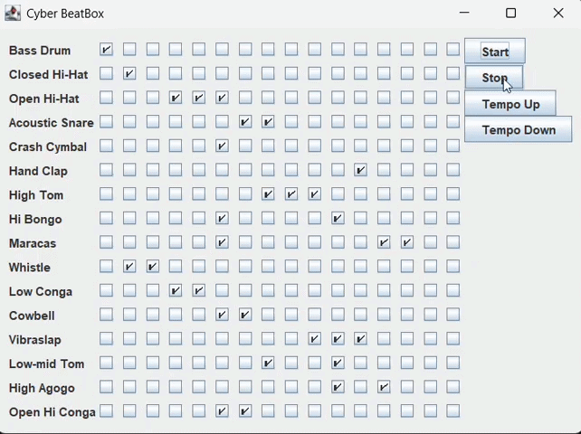
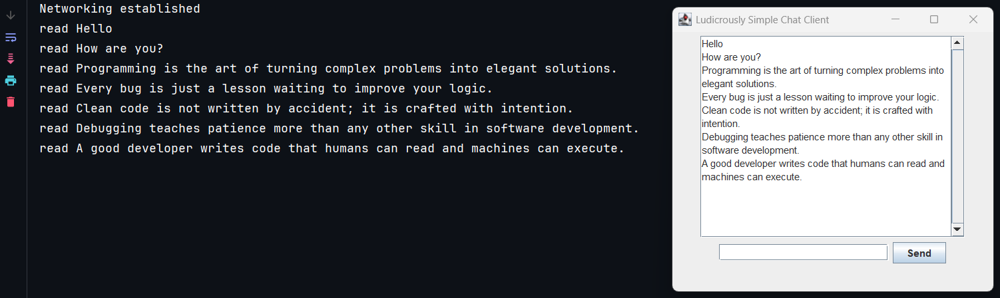

 )

---

# Java Training Repository:

The goal is to provide training in the Java language, its best practices, and its entire ecosystem, from fundamentals and basic features, through Object-Oriented Programming (OOP), flows, collections, lambdas, utility classes, GUIs, threads, client-server architecture, Maven, connections to relational databases (MySQL), CRUD operations, concurrency, patterns, design patterns, and unit testing (JUnit).

The topics are divided into folders and have explanatory README files (for learning purposes and not for architecture/application purposes).

**NOTE:** We will not delve into Docker (only superficially), web and will not discuss Spring Boot, as there are other projects on my GitHub focused on these topics, with projects in production. This extensive project is for learning, focused on Pure Java and its ecosystem (including its API for communicating with a database or running unit tests, for example).

**The main idea is to document the learning process.**

O objetivo é fornecer treinamento na linguagem Java, suas melhores práticas e todo o seu ecossistema, desde os fundamentos e recursos básicos, passando por Programação Orientada a Objetos (POO), fluxos, coleções, lambdas, classes utilitárias, GUIs, threads, arquitetura cliente-servidor, Maven, conexões com bancos de dados relacionais (MySQL), operações CRUD, concorrência, padrões, padrões de projeto e testes unitários (JUnit).

Os tópicos estão divididos em pastas e possuem arquivos README explicativos (para fins de aprendizado e não para fins de arquitetura/aplicação).

**NOTA:** Não abordaremos Docker (apenas superficialmente), web e não discutiremos Spring Boot, pois existem outros projetos no meu GitHub focados nesses tópicos, com projetos em produção. Este projeto abrangente é para aprendizado, com foco em Java puro e seu ecossistema (incluindo sua API para comunicação com um banco de dados ou execução de testes unitários, por exemplo).

**A ideia principal é documentar o processo de aprendizado.**

---

## Technologies
 

   

---

## Topics:

---

## Programming Logic Training:
Basic programming language concepts: Variables, Conditional Structures, Loops, Conditionals, Repetition Structures, Switch, Operators, Arrays, etc.

[Click here for read in English](https://github.com/Eduardo-Salvador/Java-Training/blob/main/src/main/java/ProgrammingLogicWithOOP/README.md) | [Click here for read in Portuguese-BR](https://github.com/Eduardo-Salvador/Java-Training/blob/main/src/main/java/ProgrammingLogicWithOOP/README_PT-BR.md)

## Generics:

[Click here for read in English](https://github.com/Eduardo-Salvador/Java-Training/blob/main/src/main/java/Generics/README.md) | [Click here for read in Portuguese-BR](https://github.com/Eduardo-Salvador/Java-Training/blob/main/src/main/java/Generics/README_PT-BR.md)

## Exceptions:

[Click here for read in English](https://github.com/Eduardo-Salvador/Java-Training/blob/main/src/main/java/Exceptions/README.md) | [Click here for read in Portuguese-BR](https://github.com/Eduardo-Salvador/Java-Training/blob/main/src/main/java/Exceptions/README_PT-BR.md)

## Seminar System:
Challenge of Programming Logic with basic concepts to Object-Oriented Programming, Simple Architecture and [Generics](https://github.com/Eduardo-Salvador/Java-Training/blob/main/src/Generics/README.md)

[Click here for read in English](https://github.com/Eduardo-Salvador/Java-Training/tree/main/src/main/java/StudyChallenges/SeminarSystem/README.md) | [Click here for read in Portuguese-BR](https://github.com/Eduardo-Salvador/Java-Training/blob/main/src/main/java/StudyChallenges/SeminarSystem/README_PT-BR.md)

## Inner Classes:

[Click here for read in English](https://github.com/Eduardo-Salvador/Java-Training/blob/main/src/main/java/InnerClasses/README.md) | [Click here for read in Portuguese-BR](https://github.com/Eduardo-Salvador/Java-Training/blob/main/src/main/java/InnerClasses/README_PT-BR.md)

## Collections:

[Click here for read in English](https://github.com/Eduardo-Salvador/Java-Training/blob/main/src/main/java/Collections/README.md) | [Click here for read in Portuguese-BR](https://github.com/Eduardo-Salvador/Java-Training/blob/main/src/main/java/Collections/README_PT-BR.md)

## Data Structure in Java:

[Click here for open the Project for Data Structure in Java](https://github.com/Eduardo-Salvador/Data_Strutcture-in-Java)

## Utility Classes:

[Click here for read in English](https://github.com/Eduardo-Salvador/Java-Training/blob/main/src/main/java/UtilityClasses/README.md) | [Click here for read in Portuguese-BR](https://github.com/Eduardo-Salvador/Java-Training/blob/main/src/main/java/UtilityClasses/README_PT-BR.md)

## Parameterizing Behaviors:

[Click here for read in English](https://github.com/Eduardo-Salvador/Java-Training/blob/main/src/main/java/ParameterizingBehaviors/README.md) | [Click here for read in Portuguese-BR](https://github.com/Eduardo-Salvador/Java-Training/blob/main/src/main/java/ParameterizingBehaviors/README_PT-BR.md)

## Lambdas:

[Click here for read in English](https://github.com/Eduardo-Salvador/Java-Training/blob/main/src/main/java/Lambdas/README.md) | [Click here for read in Portuguese-BR](https://github.com/Eduardo-Salvador/Java-Training/blob/main/src/main/java/Lambdas/README_PT-BR.md)

## Method Reference:

[Click here for read in English](https://github.com/Eduardo-Salvador/Java-Training/blob/main/src/main/java/MethodReference/README.md) | [Click here for read in Portuguese-BR](https://github.com/Eduardo-Salvador/Java-Training/blob/main/src/main/java/MethodReference/README_PT-BR.md)

## Optional:

[Click here for read in English](https://github.com/Eduardo-Salvador/Java-Training/blob/main/src/main/java/Optionals/README.md) | [Click here for read in Portuguese-BR](https://github.com/Eduardo-Salvador/Java-Training/blob/main/src/main/java/Optionals/README_PT-BR.md)

## Streams:

[Click here for read in English](https://github.com/Eduardo-Salvador/Java-Training/blob/main/src/main/java/Streams/README.md) | [Click here for read in Portuguese-BR](https://github.com/Eduardo-Salvador/Java-Training/blob/main/src/main/java/Streams/README_PT-BR.md)

## Graphic User Interfaces (GUI's):

[Click here for read in English](https://github.com/Eduardo-Salvador/Java-Training/blob/main/src/main/java/GUI/README.md) | [Click here for read in Portuguese-BR](https://github.com/Eduardo-Salvador/Java-Training/blob/main/src/main/java/GUI/README_PT-BR.md)

## Threads:

[Click here for read in English](https://github.com/Eduardo-Salvador/Java-Training/blob/main/src/main/java/Threads/README.md) | [Click here for read in Portuguese-BR](https://github.com/Eduardo-Salvador/Java-Training/blob/main/src/main/java/Threads/README_PT-BR.md)

## Connections: Channels and Sockets: Client-Server with Threads:

[Click here for read in English](https://github.com/Eduardo-Salvador/Java-Training/blob/main/src/main/java/ConnectionsChannelsAndSocketsWithThreads/README.md) | [Click here for read in Portuguese-BR](https://github.com/Eduardo-Salvador/Java-Training/blob/main/src/main/java/ConnectionsChannelsAndSocketsWithThreads/README_PT-BR.md)

## Pet Adoption System (CLI):
Major Learning Challenge:

[Click here for read in English](https://github.com/Eduardo-Salvador/Java-Training/blob/main/src/main/java/StudyChallenges/RegistrationSystem/README.md) | [Click here for read in Portuguese-BR](https://github.com/Eduardo-Salvador/Java-Training/blob/main/src/main/java/StudyChallenges/RegistrationSystem/README_PT-BR.md)

## Highlighted Results from Module Exercises:

**NOTE:** Most Java topics involved direct output and terminal testing in order to understand how Classes/Methods/Utilities/Tools work, but never a larger exercise. Starting with GUI and Client-Server Connections topics, it was possible to progress to more robust exercises.

**Honorable Mention:** Terminal exercises such as Streams, Generics, Exceptions, Data Structure, OOP, Utility Classes, among others, are extremely important and complex for understanding the Java ecosystem and the computing ecosystem.

**NOTA:** A maioria dos tópicos de Java envolvia saída direta e testes no terminal para entender como Classes/Métodos/Utilitários/Ferramentas funcionam, mas nunca um exercício maior. Começando com tópicos de GUI e Conexões Cliente-Servidor, foi possível progredir para exercícios mais robustos.

**Menção Honrosa:** Exercícios no terminal, como Streams, Genéricos, Exceções, Estruturas de Dados, POO, Classes Utilitárias, entre outros, são extremamente importantes e complexos para a compreensão do ecossistema Java e do ecossistema da computação.

### Graphic User Interfaces (GUI's):
BeatBox Exercise:

### Connections: Channels and Sockets: Client-Server with Threads:
Full-Duplex Multi-Client Chat:

---

## What is Apache Maven?

[Click here for read in English](https://github.com/Eduardo-Salvador/Java-Training/blob/main/src/main/java/Maven/Maven_README.md) | [Click here for read in Portuguese-BR](https://github.com/Eduardo-Salvador/Java-Training/blob/main/src/main/java/Maven/Maven_README_PT-BR.md)

