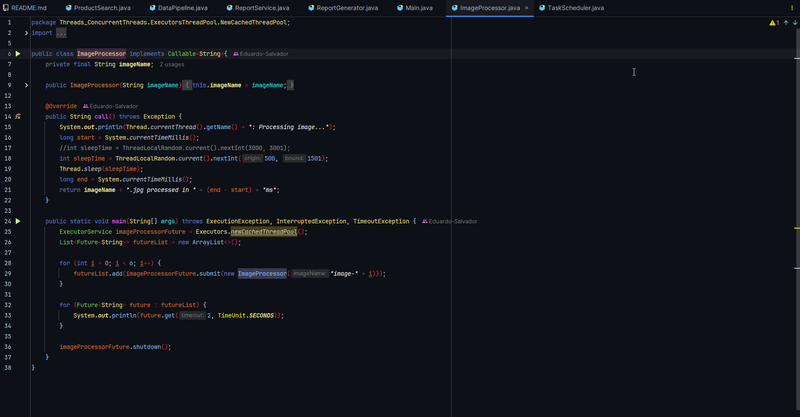
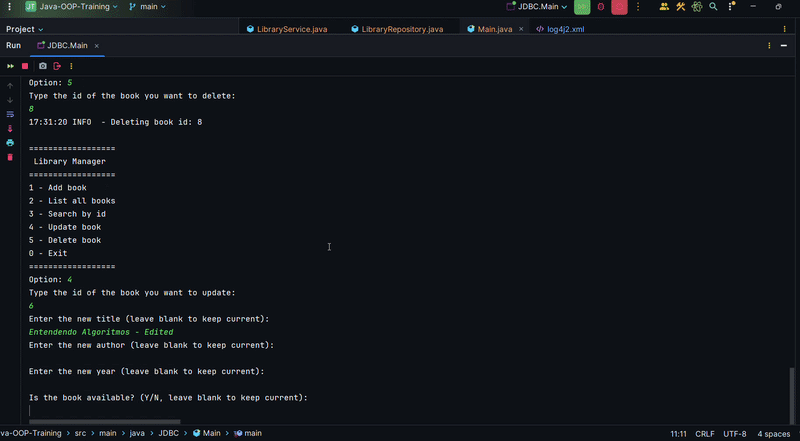
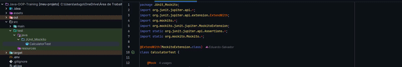
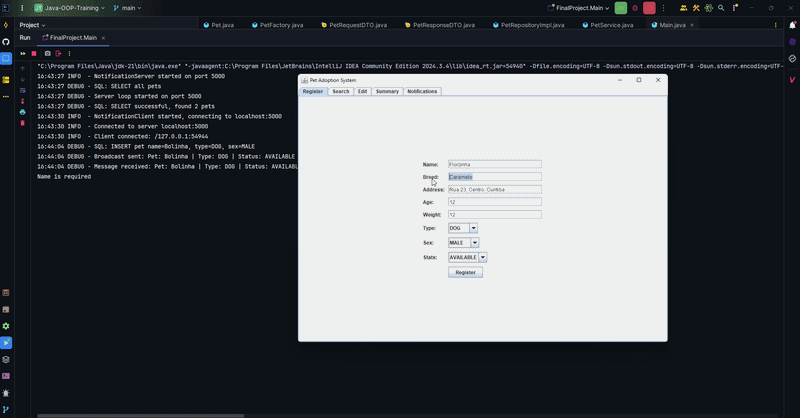
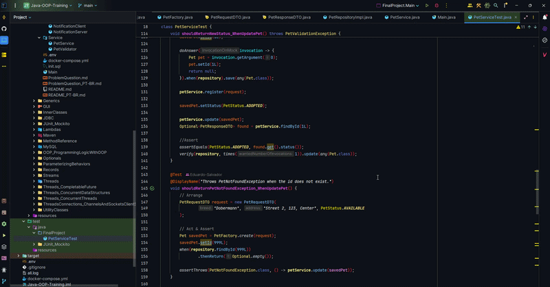

 )

---

# Quick Navigation

#### [Overview](#java-training-repository)  
#### [Technologies](#technologies)  
#### [Important Notes](#important-notes--observações-importantes)  
#### [Topics](#topics)  
#### [Highlighted Results](#highlighted-results-from-module-exercises)
#### [Apache Maven](#what-is-apache-maven)
#### [MySQL](#what-is-mysql)
#### [Docker](#summary-about-docker)
#### [JUnit and Mockito](#junit-and-mockito)
#### [Final Project](#final-project)
#### [Next Steps](#next-steps--próximos-passos)

---

# Java Training Repository

A structured and progressive deep dive into Java fundamentals and ecosystem mastery.

The [final project](#final-project) encompasses all the learning gained from this repository.

Uma imersão estruturada e progressiva nos fundamentos do Java e no domínio do ecossistema.

O [projeto final](#final-project) engloba todo o aprendizado obtido a partir deste repositório.

---

This project covers the evolution from basic programming concepts to advanced topics, including:

**Object-Oriented Programming (OOP)  
Collections and Generics  
Lambdas, Streams and Functional Programming  
Utility Classes  
GUI development  
Threads and Concurrency  
Client-Server Architecture (Sockets and Channels)  
Maven  
Relational Database Integration (MySQL)  
CRUD Operations  
Design Patterns  
Unit Testing (JUnit and Mockito)**

All topics are organized into modular folders, each containing explanatory README files.  
The structure prioritizes **learning progression and conceptual clarity**, rather than production-ready architecture.

> **Scope Note:**  
This repository intentionally focuses on Pure Java and its core ecosystem.  
It does not deeply explore Docker, Spring Boot, etc. As those topics are covered in other repositories dedicated to production-ready backend applications.

**The primary goal is to document a structured and progressive Java learning journey.**

---

O projeto cobre a evolução desde conceitos básicos de programação até tópicos mais avançados, incluindo:

**Programação Orientada a Objetos (POO)  
Coleções e Genéricos  
Lambdas, Streams e Programação Funcional  
Classes Utilitárias  
Desenvolvimento de Interfaces Gráficas (GUI)  
Threads e Concorrência  
Arquitetura Cliente-Servidor (Sockets e Channels)  
Maven  
Integração com Banco de Dados Relacional (MySQL)  
Operações CRUD  
Padrões de Projeto  
Testes Unitários (JUnit e Mockito)**

Os tópicos estão organizados em pastas modulares, cada uma com README explicativo.  
A estrutura prioriza **progressão didática e clareza conceitual**, em vez de arquitetura voltada à produção.

> **Nota de Escopo:**  
Este repositório tem foco intencional em Java puro e seu ecossistema principal.  
Docker, Spring Boot, etc. São abordados em outros repositórios voltados para aplicações backend em nível de produção.

**O objetivo principal é documentar uma jornada estruturada e progressiva de aprendizado em Java.**

---

## Technologies

#### Main  
 

#### Core Technologies
  

#### Complementary / Ecosystem Exposure

---

## Important Notes / Observações Importantes

- Some package names do not strictly follow the standard Java naming conventions (lowercase structure).
- This was intentional, as the goal of this repository is educational organization by topic.
- Other repositories follow conventional production-level package structures.
- The same applies to the Data Structure project, which also prioritizes learning organization over architectural conventions.
- The deviation does not reflect lack of knowledge regarding best practices, but rather a didactic choice.

- Alguns nomes de pacotes não seguem estritamente as convenções de nomenclatura padrão do Java (estrutura em minúsculas).
- Isso foi intencional, pois o objetivo deste repositório é a organização educacional por tópico.
- Outros repositórios seguem estruturas de pacotes convencionais de nível de produção.
- O mesmo se aplica ao projeto de Estrutura de Dados, que também prioriza a organização do aprendizado em detrimento das convenções arquiteturais.
- O desvio não reflete falta de conhecimento sobre as melhores práticas, mas sim uma escolha didática.

---

## Topics:

---

## Programming Logic Training:
Basic programming language concepts: Variables, Conditional Structures, Loops, Conditionals, Repetition Structures, Switch, Operators, Arrays, etc.

[Click here for read in English](https://github.com/Eduardo-Salvador/Java-Training/blob/main/src/main/java/OOP_ProgrammingLogicWithOOP/README.md) | [Click here for read in Portuguese-BR](https://github.com/Eduardo-Salvador/Java-Training/blob/main/src/main/java/OOP_ProgrammingLogicWithOOP/README_PT-BR.md)

## Generics:

[Click here for read in English](https://github.com/Eduardo-Salvador/Java-Training/blob/main/src/main/java/Generics/README.md) | [Click here for read in Portuguese-BR](https://github.com/Eduardo-Salvador/Java-Training/blob/main/src/main/java/Generics/README_PT-BR.md)

## Exceptions:

[Click here for read in English](https://github.com/Eduardo-Salvador/Java-Training/blob/main/src/main/java/Exceptions/README.md) | [Click here for read in Portuguese-BR](https://github.com/Eduardo-Salvador/Java-Training/blob/main/src/main/java/Exceptions/README_PT-BR.md)

## Seminar System:
Challenge of Programming Logic with basic concepts to Object-Oriented Programming, Simple Architecture and [Generics](https://github.com/Eduardo-Salvador/Java-Training/blob/main/src/Generics/README.md)

[Click here for read in English](https://github.com/Eduardo-Salvador/Java-Training/tree/main/src/main/java/Challenges/SeminarSystem/README.md) | [Click here for read in Portuguese-BR](https://github.com/Eduardo-Salvador/Java-Training/blob/main/src/main/java/Challenges/SeminarSystem/README_PT-BR.md)

## Inner Classes:

[Click here for read in English](https://github.com/Eduardo-Salvador/Java-Training/blob/main/src/main/java/InnerClasses/README.md) | [Click here for read in Portuguese-BR](https://github.com/Eduardo-Salvador/Java-Training/blob/main/src/main/java/InnerClasses/README_PT-BR.md)

## Collections:

[Click here for read in English](https://github.com/Eduardo-Salvador/Java-Training/blob/main/src/main/java/Collections/README.md) | [Click here for read in Portuguese-BR](https://github.com/Eduardo-Salvador/Java-Training/blob/main/src/main/java/Collections/README_PT-BR.md)

## Data Structure in Java:

[Click here for open the Project for Data Structure in Java](https://github.com/Eduardo-Salvador/Data_Strutcture-in-Java)

## Utility Classes:

[Click here for read in English](https://github.com/Eduardo-Salvador/Java-Training/blob/main/src/main/java/UtilityClasses/README.md) | [Click here for read in Portuguese-BR](https://github.com/Eduardo-Salvador/Java-Training/blob/main/src/main/java/UtilityClasses/README_PT-BR.md)

## Parameterizing Behaviors:

[Click here for read in English](https://github.com/Eduardo-Salvador/Java-Training/blob/main/src/main/java/ParameterizingBehaviors/README.md) | [Click here for read in Portuguese-BR](https://github.com/Eduardo-Salvador/Java-Training/blob/main/src/main/java/ParameterizingBehaviors/README_PT-BR.md)

## Lambdas:

[Click here for read in English](https://github.com/Eduardo-Salvador/Java-Training/blob/main/src/main/java/Lambdas/README.md) | [Click here for read in Portuguese-BR](https://github.com/Eduardo-Salvador/Java-Training/blob/main/src/main/java/Lambdas/README_PT-BR.md)

## Method Reference:

[Click here for read in English](https://github.com/Eduardo-Salvador/Java-Training/blob/main/src/main/java/MethodReference/README.md) | [Click here for read in Portuguese-BR](https://github.com/Eduardo-Salvador/Java-Training/blob/main/src/main/java/MethodReference/README_PT-BR.md)

## Optional:

[Click here for read in English](https://github.com/Eduardo-Salvador/Java-Training/blob/main/src/main/java/Optionals/README.md) | [Click here for read in Portuguese-BR](https://github.com/Eduardo-Salvador/Java-Training/blob/main/src/main/java/Optionals/README_PT-BR.md)

## Streams:

[Click here for read in English](https://github.com/Eduardo-Salvador/Java-Training/blob/main/src/main/java/Streams/README.md) | [Click here for read in Portuguese-BR](https://github.com/Eduardo-Salvador/Java-Training/blob/main/src/main/java/Streams/README_PT-BR.md)

## Graphic User Interfaces (GUI's):

[Click here for read in English](https://github.com/Eduardo-Salvador/Java-Training/blob/main/src/main/java/GUI/README.md) | [Click here for read in Portuguese-BR](https://github.com/Eduardo-Salvador/Java-Training/blob/main/src/main/java/GUI/README_PT-BR.md)

## Threads:

[Click here for read in English](https://github.com/Eduardo-Salvador/Java-Training/blob/main/src/main/java/Threads/README.md) | [Click here for read in Portuguese-BR](https://github.com/Eduardo-Salvador/Java-Training/blob/main/src/main/java/Threads/README_PT-BR.md)

## Threads-Connections: Channels and Sockets: Client-Server:

[Click here for read in English](https://github.com/Eduardo-Salvador/Java-Training/blob/main/src/main/java/ThreadsConnections_ChannelsAndSocketsClientServer/README.md) | [Click here for read in Portuguese-BR](https://github.com/Eduardo-Salvador/Java-Training/blob/main/src/main/java/ThreadsConnections_ChannelsAndSocketsClientServer/README_PT-BR.md)

## Threads: Concurrent Threads

[Click here for read in English](https://github.com/Eduardo-Salvador/Java-Training/blob/main/src/main/java/Threads_ConcurrentThreads/README.md) | [Click here for read in Portuguese-BR](https://github.com/Eduardo-Salvador/Java-Training/blob/main/src/main/java/Threads_ConcurrentThreads/README_PT-BR.md)

## Async Threads: Completable Future

[Click here for read in English](https://github.com/Eduardo-Salvador/Java-Training/blob/main/src/main/java/Threads_CompletableFuture/README.md) | [Click here for read in Portuguese-BR](https://github.com/Eduardo-Salvador/Java-Training/blob/main/src/main/java/Threads_CompletableFuture/README_PT-BR.md)

## Threads: Concurrent Data Structures:

[Click here for read in English](https://github.com/Eduardo-Salvador/Java-Training/blob/main/src/main/java/Threads_ConcurrentDataStructures/README.md) | [Click here for read in Portuguese-BR](https://github.com/Eduardo-Salvador/Java-Training/blob/main/src/main/java/Threads_ConcurrentDataStructures/README_PT-BR.md)

## Records: Immutable Objects

[Click here for read in English](https://github.com/Eduardo-Salvador/Java-Training/blob/main/src/main/java/Records/README.md) | [Click here for read in Portuguese-BR](https://github.com/Eduardo-Salvador/Java-Training/blob/main/src/main/java/Records/README_PT-BR.md)

## Design Patterns:
Builder, Factory, Singleton (The 3 Initializations) and Data Transfer Objects (DTOs)

[Click here for read in English](https://github.com/Eduardo-Salvador/Java-Training/blob/main/src/main/java/DesignPatterns/README.md) | [Click here for read in Portuguese-BR](https://github.com/Eduardo-Salvador/Java-Training/blob/main/src/main/java/DesignPatterns/README_PT-BR.md)

## Java Data Base Connective (JDBC):

[Click here for read in English](https://github.com/Eduardo-Salvador/Java-Training/blob/main/src/main/java/JDBC/README.md) | [Click here for read in Portuguese-BR](https://github.com/Eduardo-Salvador/Java-Training/blob/main/src/main/java/JDBC/README_PT-BR.md)

---

## Highlighted Results from Module Exercises:

**NOTE:** Most Java topics involved direct output and terminal testing in order to understand how Classes/Methods/Utilities/Tools work, but never a larger exercise. Starting with GUI and Client-Server Connections topics, it was possible to progress to more robust exercises.

**Honorable Mention:** Terminal exercises such as Streams, Generics, Exceptions, Data Structure, OOP, Utility Classes, among others, are extremely important and complex for understanding the Java ecosystem and the computing ecosystem.

**NOTA:** A maioria dos tópicos de Java envolvia saída direta e testes no terminal para entender como Classes/Métodos/Utilitários/Ferramentas funcionam, mas nunca um exercício maior. Começando com tópicos de GUI e Conexões Cliente-Servidor, foi possível progredir para exercícios mais robustos.

**Menção Honrosa:** Exercícios no terminal, como Streams, Genéricos, Exceções, Estruturas de Dados, POO, Classes Utilitárias, entre outros, são extremamente importantes e complexos para a compreensão do ecossistema Java e do ecossistema da computação.

### Threads with Streams and Lambdas:

### Graphic User Interfaces (GUI's):
BeatBox Exercise:

### Connections: Channels and Sockets: Client-Server with Threads:
Full-Duplex Multi-Client Chat:

### Java Data Base Connective (JDBC):
Complete Crud (CLI) - Click to go Youtube:

### JUnit and Mockito:

---

## What is Apache Maven?

[Click here for read in English](https://github.com/Eduardo-Salvador/Java-Training/blob/main/src/main/java/Maven/README.md) | [Click here for read in Portuguese-BR](https://github.com/Eduardo-Salvador/Java-Training/blob/main/src/main/java/Maven/README_PT-BR.md)

---

## What is MySQL?

[Click here for read in English](https://github.com/Eduardo-Salvador/Java-Training/blob/main/src/main/java/MySQL/README.md) | [Click here for read in Portuguese-BR](https://github.com/Eduardo-Salvador/Java-Training/blob/main/src/main/java/MySQL/README_PT-BR.md)

## MySQL Notes:

**Quick Overview:** MySQL was configured through Docker to handle the JDBC topic, one of the most important aspects of the project.

*The SQL operations covered here serve as the foundation for understanding how JDBC interacts with a relational database*

---

## Summary about Docker:

[Click here for read in English](https://github.com/Eduardo-Salvador/Java-Training/blob/main/src/main/java/Docker/README.md) | [Click here for read in Portuguese-BR](https://github.com/Eduardo-Salvador/Java-Training/blob/main/src/main/java/Docker/README_PT-BR.md)

## Docker Compose Config:

[Click here for view docker-compose.yml](https://github.com/Eduardo-Salvador/Java-Training/blob/main/docker-compose.yml)

## Docker Notes:

**Quick Overview:** Docker was configured to use MySQL to handle the JDBC topic, one of the most important aspects of the project.

*We will not cover technical explanations about Docker in this project.*

---

## JUnit and Mockito:

Basic conceptions:

[Click here for read in English](https://github.com/Eduardo-Salvador/Java-Training/blob/main/src/main/java/JUnit_Mockito/README.md) | [Click here for read in Portuguese-BR](https://github.com/Eduardo-Salvador/Java-Training/blob/main/src/main/java/JUnit_Mockito/README_PT-BR.md)

Tests: [JUnit and Mockito Exercise](https://github.com/Eduardo-Salvador/Java-Training/blob/main/src/test/java/JUnit_Mockito/CalculatorTest.java)

---

## Final Project:

### Pet Adoption System v1.0:
Command Line Project (CLI):

[Click here for read in English](https://github.com/Eduardo-Salvador/Java-Training/blob/main/src/main/java/Challenges/RegistrationSystem/README.md) | [Click here for read in Portuguese-BR](https://github.com/Eduardo-Salvador/Java-Training/blob/main/src/main/java/Challenges/RegistrationSystem/README_PT-BR.md)

### Pet Adoption System v2.0:
GUI + JDBC + MySQL + JUnit_Mockito + All Topics:

#### Results:

#### Tests:

#### Problem Question:

[Click here for Problem question in English](https://github.com/Eduardo-Salvador/Java-Training/blob/main/src/main/java/FinalProject/ProblemQuestion.md) | [Click here for Problem Question in Portuguese-BR](https://github.com/Eduardo-Salvador/Java-Training/blob/main/src/main/java/FinalProject/ProblemQuestion_PT-BR.md)

#### README for solution:

[Click here for Reame in English](https://github.com/Eduardo-Salvador/Java-Training/blob/main/src/main/java/FinalProject/README.md) | [Click here for Readme in Portuguese-BR](https://github.com/Eduardo-Salvador/Java-Training/blob/main/src/main/java/FinalProject/README_PT-BR.md)

---

## Next Steps / Próximos Passos

https://github.com/Eduardo-Salvador

This repository builds a strong foundation in core Java and low-level concepts.
The next natural step is applying this knowledge in modern backend ecosystems such as:
- Spring Boot
- REST API development
- HTTP communication
- Docker containerization
- Software Architecture patterns
- Scalable backend applications

These topics are explored in other repositories focused on real-world and production-level applications.

Este repositório oferece uma base sólida em Java e conceitos de baixo nível.
O próximo passo natural é aplicar esse conhecimento em ecossistemas de backend modernos.
- Spring Boot
- Desenvolvimento de APIs REST
- Comunicação HTTP
- Docker
- Arquitetura de Software
- Aplicações de backend escaláveis

Esses tópicos são explorados em outros repositórios focados em aplicações do mundo real e em nível de produção.

---